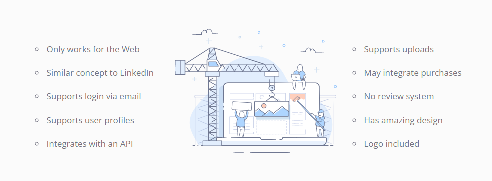

# BE

## User stories

1- As a company or jobseeker I want to rigister in your website by signup using username, email and password, so that make me authenticate and has an account, and after that I can sign in the website for more access.

2- As a company or jobseeker I want to add, edit, update and delete my profile, so that the process be more flexable.

3- As a company I want to filter the candidates based on skills, experience, and education, so that make me pick the suitable candidates easly.

4- As a company I want to add the candidates into short list to arrange an interview for them.

5- As a jobseeker I want to see how many companies have seen my profile.

6- As a jobseeker I want to know the parcentage for profile completence, so I can complete it.

7- As a jobseeker I want to see the arrangment interviews in my profile, so I can prepare my self for interviews in better way.

## Scope (In/Out)

>### IN - What will your product do

1. Our website will service both companies and candidates.

2. Company can find the candidates by filter them based on age, experience, salary, skills, and education.

3. Company can add the candidates into short list to review them profiles later.

4. Company can arrange an interview for suitable candidates.

5. Candidate can add his profile, so it will be showable for the companies.

6. Candidate can see how many companies have seen his profile.

7. Candidate can preview random profile for other candidate, so he can compare his profile with another one.

> ### OUT - What will your product not do

1. Our website will not be responsive, so only the user can browse it from labtop. 

## Vision

1- What is the vision of this product? 

The vision of our product is to connect the most talented and qualified technology professionals with top companies and organizations, to help them achieve their digital transformation goals and drive innovation in their industry. our product aims to be the go-to platform for companies looking to hire top tech talent, and for tech professionals looking to advance their careers and work on cutting-edge projects.

2- What pain point does this project solve?

Our product aims to solve the pain point of finding the right technology talent for companies.

The process of recruiting and hiring technology professionals can be time-consuming, expensive and difficult, and many companies struggle to find the right fit for their specific needs. our product aims to make this process more efficient by connecting companies with a large pool of qualified and vetted technology professionals, saving them time and money in the process. Additionally, our product also provides a platform for tech professionals to showcase their skills and find job opportunities that align with their career goals.

3- Why should we care about your product?

You should care about our product because it offers a solution to a major pain point for companies looking to hire technology professionals. With the rapid pace of technological advancements and the increasing importance of digital transformation, having access to top tech talent is essential for companies to stay competitive. our product provides a platform that makes it easy for companies to find and hire the right technology professionals for their specific needs, saving them time and money in the process. Additionally, it also provides an opportunity for technology professionals to find job opportunities that align with their career goals, and stay updated with the latest technologies and trends. Overall, our product is a valuable tool for both companies and technology professionals, and it can help drive innovation and growth in the technology industry.

## Minimum Viable Product (MVP)

## Stretch

Add subsecription feature to get the user more accessabilty in our website.

## Functional Requirements

1- An admin can create and delete user accounts.

2- An employer can add company profile, edit, update and delete it.

3- A jobseeker can add his profile, edit, update and delete it.

## Non-Functional Requirements

Some non-functional requirements for our product could include:

1. Security: The platform must have robust security measures in place to protect user data and prevent unauthorized access.

2. Scalability: The platform must be able to handle a large number of users and handle large amounts of data.

3. Performance: The platform must load quickly and be responsive to user interactions.

4. Usability: The platform must be user-friendly and easy to navigate for both companies and technology professionals.

5. Accessibility: The platform must be accessible to users with disabilities, and comply with accessibility standards.

6. Maintenance: The platform must be easy to maintain and update, with minimal downtime.

7. Reliability: The platform must be highly available and have minimal downtime.

8. Compliance: The platform must comply with relevant data protection and privacy regulations.

9. Backup & Recovery: The platform must have an efficient backup and recovery process to ensure data safety.

10. Monitoring: The platform must have monitoring system to keep track of the performance, downtime, and errors.

## Data Flow

>1. As a Company:

A) First of all the company should register in our website by username, email and password.

B) After sign up, the company will move into sign in page and enter our website using username and password.

C) After that, it will lead the company into home page, which contains the search bar that allows the employer to filter candidates based on skills, experience, salary, age and education and other things.

D) If the candidate was suitable for the company, it can arrange an interview for him.

E) If the company want to pick more than one candidate, they can add them into short list to review them profiles.

F) Finally, the company can logout from our website, and everything will be saved. 

>2. As a Jobseeker:

1- Jobseeker creates an account: The jobseeker creates an account on the platform by providing basic information such as name, email, and password.

2- Jobseeker completes their profile: Once logged in, the jobseeker completes their profile by providing information such as their education, work experience, skills, and portfolio.

3- Jobseeker receives notifications: The jobseeker will receive notifications when a company views their profile or when they are selected for an interview.

4- Jobseeker communicate with the company: After being selected, the jobseeker can communicate with the company regarding the job offer, negotiation and other relevant information.

5- Jobseeker accepts or decline the offer: Once the jobseeker receives an offer, they can accept or decline the offer, and the data is stored accordingly.
